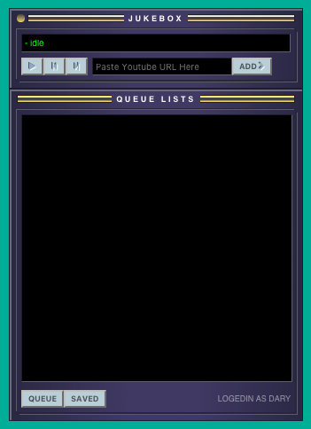

# Jukedox !!

Jukebox party audio player that let play music from Youtube and save into local storage.

Built it with React, Redis, Mopidy, and SQLite.



## Installation

Install [Redis](http://redis.js.org) Server and [Mopidy](https://www.mopidy.com/) first

_Also Install [mopidy-youtube](https://github.com/mopidy/mopidy-youtube
)_

_*To Install Mopidy, make sure Python3.x is already installed_

then run

```
npm install
```

Run Server in development mode

```
npm run start
node server/index
```

## Build for production

```
npm run build
``` 

Access page at http://localhost:3000

## Serve application

```
node server/index
```

Access page at http://localhost:9000

### config.json example

```
{
  "development": {
    "username": "root",
    "password": null,
    "database": "jukebox",
    "host": "127.0.0.1",
    "dialect": "mysql",
    "use_env_variable": "sqlite"
  },
  "sqlite": {
    "storage": "./database.sqlite",
    "dialect": "sqlite"
  },
  "test": {
    "username": "root",
    "password": null,
    "database": "database_test",
    "host": "127.0.0.1",
    "dialect": "mysql"
  },
  "production": {
    "username": "root",
    "password": null,
    "database": "database_production",
    "host": "127.0.0.1",
    "dialect": "mysql"
  },
  "mopidy": "127.0.0.1:6680"
}
```